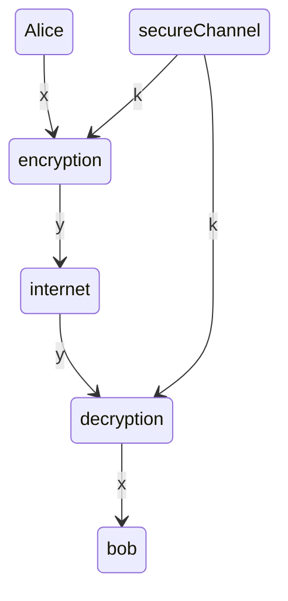

# Week 1 Intro to Cryptography

## Directory
- [Home](/README.md#table-of-contents)
- **&rarr;[Week 1 Intro to Cryptography](/week1/README.md#directory)**
- [Week 2 More on Classic Ciphers and Their Math](/week2/README.md#directory)

## 1.2 Introduction to Cryptography
[top](#directory)

### Cryptology
- Cryptography: the *making* of secret ciphers
- Cryptoanalysis: the *breaking* of secret ciphers

### Cryptography
- symmetric ciphers
  - block ciphers
  - stream ciphers
- asymmetric ciphers
- protocols

### Cryptoanalysis
- Classical Attacks
  - math analysis
  - brute force
- Implementation attacks
- social engineering

### Encryption/Decryption Process

-plaintext
  - encryption algo
  - encryption key
-ciphertext
  - transmission
-ciphertext
  - decryption algo
  - decryption key
-plaintext

**basic principles**
> the security of a cryptosystem rests on the secret key

> assume your oponent knows you ecnryption algos
- security through obscurity doesn't work

### Types of Attacks on Cryptosystems

- ciphertext attack
  - given a ciphertext, deduce the key
- plaintext attack
  - given a plaintext/ciphertext pair, deduce the key
- chosen plaintext attack
  - choose a plaintext and produce a ciphertext, deduce the key
- chosen ciphertext attack
  - choose a ciphertext and decrypt to a plaintext, deduce the key

## 1.3 Monoalphabetic Ciphers and Beginning Number Theory
[top](#directory)

### Monoalphabetic Subsitution Ciphers
- shift cipher
- a&rarr;x etc

### Modulus (or Mod) Function

$\mathbb{Z}=\{...,-3,-2,-1,0,1,2,3,...\}$ the integers
$\mathbb{N}=\{0,1,2,3,...\}$ the natural (or counting) numbers
$\mathbb{Z}^{+}=\{1,2,3,...\}$ the positie integers

suppose that $x\isin{\mathbb{Z}}$ and $n\isin{\mathbb{Z}^{+}}$

Definition 1 (informal)

$x\mod{n}=$the remainder from dividing x by n

Definition 2 (formal)

$x\mod{n}=_{def}r$ where for some $q\isin{\mathbb{Z}}$:

- $x=q\cdot{n}+r$
- $0\le{r}\lt{n}$

### Divisibility

**Definition 3**
suppose $a,d\isin{\mathbb{z}}$ with $d\neq{0}$
we say that d is a *divisor* of a (written d|a)
if and only if there is a $b\isin{\mathbb{Z}}$ with $a=b\cdot{d}$

### Examples
- 2|8 since 8=4*2
- 5|-5 since -5 = (-1)*5
- 6$\nmid$17

### Discrete-Math/Logic Reminder

**P implies Q**
aka: if P then Q
means: whenever P is true, then so is Q
notation: P&rArr;Q

**P if and only if Q**
aka: P iff Q
means: (P implies Q) and (Q implies P)
notation: P&hArr;Q

## 1.4 More on Divisibility
[top](#directory)

**Lemma 4**

a. d|a and a|b &rArr; d|b
b. d|a iff d|(-a)
c. d|a iff -d|a
d. &pm;1|a for any a &in; &#8484;
e. &pm;d|0 for any d &in; &#8484;+
f. a&ne;0 & d|a &rArr; |d|&le;|a|
g. a&ne;0 & d|a & a&ne;&pm;d &rArr; |d| &lt;|a|
h. d|&pm;1 & &rArr; d=&pm;1
i. a|b & b|a &rArr; a=&pm;b
j d|a & d|b &rArr; (&forall;x,y)[d|(ax+by)]

### Euclid's Division Lemma

**Lemma 5**

Suppose A&in;&#8484; and b&in;&#8484;+

Then there are **unique** q and r with:
a=q*b+r and 0&le;r&lt;b

### Two Tools for Reasoning About Integers

Recall: &#8469;=def{0,1,2,3,4...} the natural numbers

**the well-ordering axiom (WOA)**
if S&sube;&#8469; is nonempty, the S contains a *least* element

**Mathematical Induction (MI)**
if P(0) and (&forall;k)[P(k)&rArr;P(k+1)], then (&forall;k)P(k)

These two principles are equivalent

## Live Session
[top](#directory)

Cryptography is the practice and science of secure coding techniques.
Writing and reading secret messages from source to destination

Cryptanalysis is the breaking and cracking of secret messages

Cryptology is the mathematical and scientific study of crypography and crytanalysis

Cipher is an algorithm that hides plaintext messages
TLS has replaced SSL
telnet does not mean ssh

x is the plaintext or cleartext
y is called ciphertext
k is called the key
the set of all possible keys in called the key space

### Symmetric Encryption
- For: Confidentiality
- How: Same key to encrypt and decrypt
- Pro: Fast
- Con: Key distribution problem
  - how do we pass the key to the necessary parties?
- Older algos: DES, 3DES, RC4
- Today's standard algorithm: AES
- Algorithm commonly found in malware: XOR

- ALWAYS USED FOR BULK DATA ENCRYPTION

### Asymmetric Encryption

- For: Confidentiality
- How: Different keys to encrypt and decrypt
  - public key
  - private key
- Con: sow
- Pro: No key distribution problem
- Today's standard algorithm: RSA

### Principles of Assymetric Encryption
